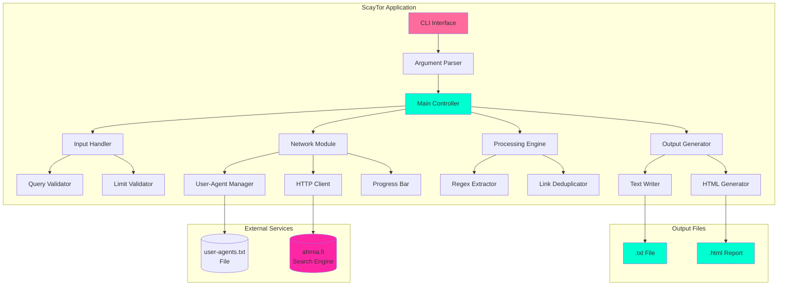
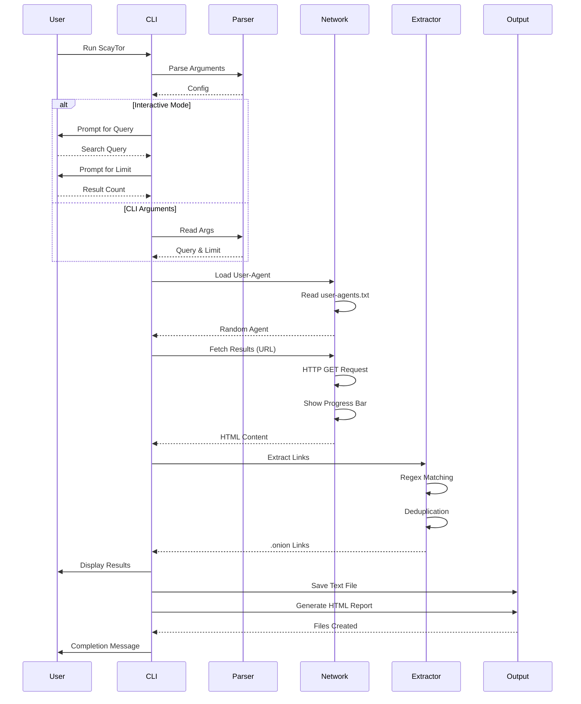
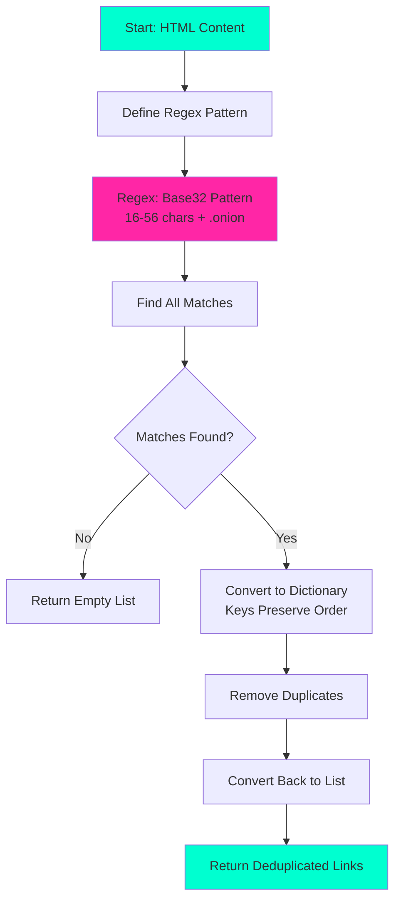
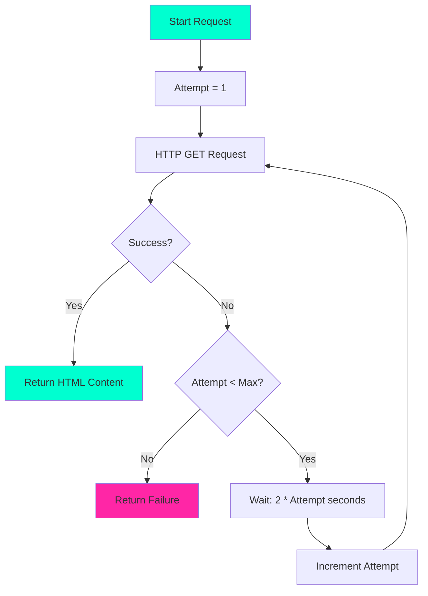
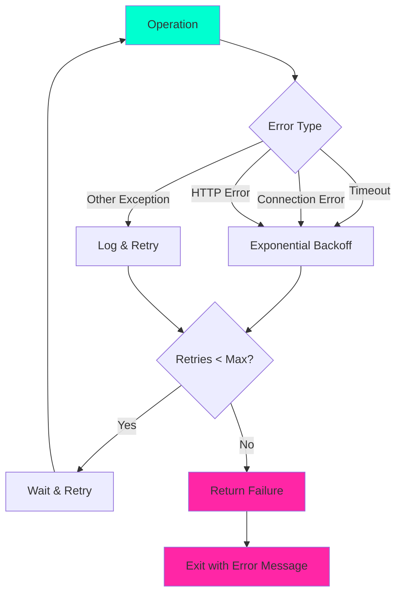
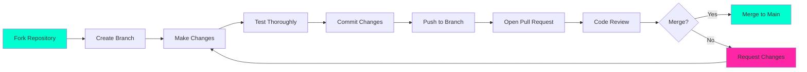

<div align="center">

# 🕵️‍♂️ ScayTor

> **A Modern, Professional Tool for Searching and Collecting .onion Sites from the Clearnet**

[](https://www.python.org/downloads/)
[](LICENSE)
[]()
[]()

**Made with ❤️ by Scayar**

---

</div>

## 📋 Table of Contents

- [Overview](#-overview)
- [Features](#-features)
- [Architecture & Design](#-architecture--design)
- [Installation](#-installation)
- [Usage](#-usage)
- [Documentation](#-documentation)
- [Troubleshooting](#-troubleshooting)
- [Security & Legal Notice](#-security--legal-notice)
- [Contributing](#-contributing)
- [Credits](#-credits)

---

## 🎯 Overview

**ScayTor** is a powerful, feature-rich command-line tool designed for security researchers, penetration testers, and cybersecurity enthusiasts who need to search and collect `.onion` (Tor hidden service) addresses from the clearnet. 

### Why ScayTor?

- 🔍 **Smart Search**: Queries ahmia.fi search engine with intelligent retry mechanisms
- 🎨 **Beautiful Interface**: Hacker-themed CLI with color-coded output and animations
- 📊 **Multiple Outputs**: Generates both text files and professional HTML reports
- 🛡️ **Robust Error Handling**: Comprehensive error handling with exponential backoff
- ⚡ **Performance**: Threaded progress indicators and efficient processing
- 🌓 **Dark/Light Mode**: HTML reports support both themes with dynamic banner switching

---

## ✨ Features

### Core Functionality

| Feature | Description |
|---------|-------------|
| 🔍 **Smart Search** | Queries ahmia.fi search engine for .onion sites |
| 🎯 **Precise Extraction** | Advanced regex pattern matching for valid .onion addresses (16-56 character base32) |
| 🔄 **User-Agent Rotation** | Randomizes user agents from `user-agents.txt` to avoid rate limiting |
| 📊 **Progress Indicators** | Real-time animated progress bars during network operations |
| 🎨 **Beautiful CLI** | Hacker-themed interface with color-coded output and typewriter effects |
| 💻 **Command-Line Arguments** | Support for `--query`, `--limit`, `--output`, and `--no-progress` flags |

### Output & Reporting

| Format | Features |
|--------|----------|
| 📄 **Text Files** | Clean, line-separated .onion addresses saved to `.txt` files |
| 🌐 **HTML Reports** | Professional, responsive HTML reports with:<br>• Dark/Light mode toggle<br>• Dynamic banner images (CuteCat/Scarycat)<br>• Clickable .onion links<br>• Timestamp and search query display<br>• Modern, accessible design |

### Reliability & Robustness

- 🛡️ **Error Handling**: Comprehensive error handling with retry mechanisms and exponential backoff
- ⚡ **Efficient**: Threading for non-blocking progress updates
- 🔒 **Safe**: Proper URL encoding and input validation
- 📝 **Logging**: Clear status messages and warnings
- 🔄 **Retry Logic**: Automatic retries with exponential backoff on failures

---

## 🏗️ Architecture & Design

### System Architecture



### Data Flow Diagram



### Component Interaction Flow

```
┌─────────────────────────────────────────────────────────────────┐
│                         ScayTor Workflow                        │
└─────────────────────────────────────────────────────────────────┘
                              │
                              ▼
                    ┌─────────────────┐
                    │  Print Banner   │ ◄── ASCII Art Display
                    └────────┬────────┘
                             │
                             ▼
              ┌──────────────────────────────┐
              │  Parse Command-Line Args     │
              │  (--query, --limit, --output)│
              └──────┬───────────────────────┘
                     │
        ┌────────────┴────────────┐
        │                         │
        ▼                         ▼
┌───────────────┐        ┌───────────────┐
│  Interactive  │        │  CLI Args     │
│     Mode      │        │    Mode       │
└───────┬───────┘        └───────┬───────┘
        │                         │
        └────────────┬────────────┘
                     │
                     ▼
            ┌─────────────────┐
            │  Get User Agent │ ◄── Random Selection
            └────────┬────────┘     from user-agents.txt
                     │
                     ▼
            ┌─────────────────┐
            │  Build URL      │ ◄── URL Encoding
            │  & Headers      │
            └────────┬────────┘
                     │
                     ▼
            ┌─────────────────┐
            │  Fetch Results  │ ◄── HTTP GET
            │ (with retries) │     Progress Bar
            └────────┬────────┘     Exponential Backoff
                     │
                     ▼
            ┌─────────────────┐
            │ Extract Links  │ ◄── Regex Pattern
            │  (.onion URLs) │     Deduplication
            └────────┬────────┘
                     │
                     ▼
            ┌─────────────────┐
            │ Display Results │ ◄── Console Output
            │  (Colored)      │     (Typewriter Effect)
            └────────┬────────┘
                     │
                     ▼
        ┌─────────────────────────────┐
        │      Save to Files         │
        ├─────────────────────────────┤
        │  • .txt (plain text)        │
        │  • .html (styled report)    │
        └─────────────────────────────┘
```

### Algorithm Flowcharts

#### .onion Link Extraction Algorithm



#### Network Request with Retry Logic



---

## 🚀 Installation

### Prerequisites

- **Python 3.8+** (tested on 3.8, 3.9, 3.10, 3.11, 3.12)
- **pip** (Python package manager)
- **Internet connection** (for fetching search results)

### Quick Installation

```bash
# Clone the repository
git clone https://github.com/scayar/ScayTor.git
cd ScayTor

# Install dependencies
pip install -r requirements.txt

# Run ScayTor
python TorSearch.py
```

### Step-by-Step Installation

#### 1. **Clone or Download the Repository**

```bash
git clone https://github.com/scayar/ScayTor.git
cd ScayTor
```

Or download and extract the ZIP file from the releases.

#### 2. **Install Dependencies**

Using pip:
```bash
pip install -r requirements.txt
```

Or manually:
```bash
pip install colorama requests
```

For Python 3, you may need:
```bash
pip3 install colorama requests
```

#### 3. **Verify Installation**

```bash
python TorSearch.py --version
```

Expected output:
```
ScayTor 2.0.0
```

### Dependencies

| Package | Version | Purpose |
|---------|---------|---------|
| `colorama` | >=0.4.6 | Cross-platform colored terminal text |
| `requests` | >=2.31.0 | HTTP library for API requests |

---

## 📖 Usage

### Basic Usage (Interactive Mode)

```bash
python TorSearch.py
```

The tool will prompt you for:
1. Search query
2. Number of results to retrieve

### Command-Line Arguments

ScayTor supports various command-line arguments for automation and scripting:

```bash
python TorSearch.py --query "marketplace" --limit 20
python TorSearch.py -q "security" -l 10 -o results.txt
python TorSearch.py --query "tor" --limit 5 --no-progress
```

#### Available Options

| Flag | Short | Description | Example |
|------|-------|-------------|---------|
| `--query` | `-q` | Search query | `--query "marketplace"` |
| `--limit` | `-l` | Number of results | `--limit 20` |
| `--output` | `-o` | Output filename | `--output results.txt` |
| `--no-progress` | | Disable progress bar | `--no-progress` |
| `--version` | `-v` | Show version | `--version` |

### Example Sessions

#### Interactive Mode

```
                                              ___
                                          ,o88888
                                       ,o8888888'
                 ,:o:o:oooo.        ,8O88Pd8888"
             ,.::.::o:ooooOoOoO. ,oO8O8Pd888'"
           ,.:.::o:ooOoOoOO8O8OOo.8OOPd8O8O"
          , ..:.::o:ooOoOOOO8OOOOo.FdO8O8"
         , ..:.::o:ooOoOO8O888O8O,COCOO"
        , . ..:.::o:ooOoOOOO8OOOOCOCO"
         . ..:.::o:ooOoOoOO8O8OCCCC"o
            . ..:.::o:ooooOoCoCCC"o:o
            . ..:.::o:o:,cooooCo"oo:o:
         `   . . ..:.:cocoooo"'o:o:::'
         .`   . ..::ccccoc"'o:o:o:::'
        :.:.    ,c:cccc"':.:.:.:.:.'
      ..:.:"'`::::c:"'..:.:.:.:.:.'
    ...:.'.:.::::"'    . . . . .'
   .. . ....:."' `   .  . . . ''
 . . . ...."'
 .. . ."'     ScayTor 

[?] Enter your search: cybersecurity
[?] How many .onion sites do you want? 5
[*] Fetching from ahmia.fi |██████████████████████████████| 100%
[+] Found 12 .onion links. Displaying up to 5...
[01] example1234567890abcdef.onion
[02] example0987654321fedcba.onion
[03] exampleabcdef1234567890.onion
[04] examplefedcba0987654321.onion
[05] example1122334455667788.onion
[+] Completed! 5 links saved in a3b2c.txt
[+] HTML report generated: a3b2c.html
[=] Session complete. Stay anonymous, hacker.
```

#### Command-Line Mode

```bash
$ python TorSearch.py --query "marketplace" --limit 10 --output market_results

                                              ___
                                          ,o88888
                                       ,o8888888'
                 ,:o:o:oooo.        ,8O88Pd8888"
             ,.::.::o:ooooOoOoO. ,oO8O8Pd888'"
           ,.:.::o:ooOoOoOO8O8OOo.8OOPd8O8O"
          , ..:.::o:ooOoOOOO8OOOOo.FdO8O8"
         , ..:.::o:ooOoOO8O888O8O,COCOO"
        , . ..:.::o:ooOoOOOO8OOOOCOCO"
         . ..:.::o:ooOoOoOO8O8OCCCC"o
            . ..:.::o:ooooOoCoCCC"o:o
            . ..:.::o:o:,cooooCo"oo:o:
         `   . . ..:.:cocoooo"'o:o:::'
         .`   . ..::ccccoc"'o:o:o:::'
        :.:.    ,c:cccc"':.:.:.:.:.'
      ..:.:"'`::::c:"'..:.:.:.:.:.'
    ...:.'.:.::::"'    . . . . .'
   .. . ....:."' `   .  . . . ''
 . . . ...."'
 .. . ."'     ScayTor 

[*] Fetching from ahmia.fi |██████████████████████████████| 100%
[+] Found 25 .onion links. Displaying up to 10...
[01] marketplace1234567890.onion
...
[+] Completed! 10 links saved in market_results.txt
[+] HTML report generated: market_results.html
[=] Session complete. Stay anonymous, hacker.
```

---

## 📚 Documentation

### Core Functions

#### 1. CLI Interface Module

**Functions:**
- `print_banner()`: Displays ASCII art banner
- `type_out()`: Animated character-by-character printing
- `hacker_prompt()`: Styled input prompts with typewriter effect

**Features:**
- Color-coded output (green for prompts, red for errors, cyan for info)
- Typewriter effect for dramatic presentation
- Cross-platform color support via colorama

#### 2. Input Validation Module

**Functions:**
- `get_search_query()`: Validates and URL-encodes search input
- `get_result_limit()`: Ensures positive integer input

**Validation Rules:**
- Search query cannot be empty
- Result count must be positive integer
- Proper URL encoding using `urllib.parse.quote_plus`

#### 3. Network Module

**Functions:**
- `get_user_agent()`: Loads and randomizes user agents
- `fetch_results()`: HTTP GET with retry logic and exponential backoff
- `progress_bar()`: Animated progress indicator using threading

**Features:**
- 3 retry attempts on failure
- 15-second timeout per request
- Exponential backoff (2s, 4s, 6s delays)
- Threaded progress bar animation
- Random user-agent selection from `user-agents.txt`
- Enhanced HTTP headers for better compatibility

#### 4. Processing Module

**Functions:**
- `extract_onion_links()`: Regex-based link extraction with deduplication

**Pattern:**
```regex
\b[a-zA-Z2-7]{16,56}\.onion\b
```

**Explanation:**
- `\b`: Word boundary (prevents partial matches)
- `[a-zA-Z2-7]`: Base32 alphabet (no 0, 1, 8, 9)
- `{16,56}`: Valid .onion address length range
- `\.onion`: Literal ".onion" TLD

#### 5. Output Module

**Functions:**
- `save_results()`: Writes .txt file with links
- `save_html_report()`: Generates styled HTML report with dark/light mode

**File Formats:**

**Text File:**
- One .onion URL per line
- UTF-8 encoding
- Random 5-character alphanumeric filename (or custom via `--output`)
- Easy to parse programmatically

**HTML File:**
- Self-contained HTML with embedded CSS/JS
- Responsive design (mobile-friendly)
- Dark/Light mode toggle
- Dynamic banner switching (CuteCat/Scarycat)
- Clickable links (open in Tor Browser)
- Professional styling with CSS variables

### Error Handling Strategy



---

## 🐛 Troubleshooting

### Common Issues and Solutions

#### Issue 1: "No .onion links found"

**Symptoms:**
- Tool runs successfully but returns 0 links

**Possible Causes:**
- Search query too specific
- ahmia.fi returned no results
- Network connectivity issues

**Solutions:**
1. Try broader search terms
2. Check internet connection
3. Verify ahmia.fi is accessible: `curl https://ahmia.fi`
4. Try a different search query

#### Issue 2: "Failed to fetch results after 3 attempts"

**Symptoms:**
- Network requests fail repeatedly

**Possible Causes:**
- Network timeout
- ahmia.fi server issues
- Firewall blocking requests
- Proxy configuration

**Solutions:**
1. Check internet connection
2. Try again later (server might be down)
3. Verify firewall/proxy settings
4. Ensure `user-agents.txt` exists
5. Try using `--no-progress` flag

#### Issue 3: Image not showing in HTML report

**Symptoms:**
- HTML report generated but banner images missing

**Possible Causes:**
- Banner images missing (`CuteCat.png`, `Scarycat.png`)
- Incorrect file paths
- File permissions

**Solutions:**
1. Ensure `CuteCat.png` and `Scarycat.png` are in same directory as script
2. Check file permissions
3. Verify filenames match exactly (case-sensitive on Linux/Mac)
4. Images are optional - report will work without them

#### Issue 4: ModuleNotFoundError

**Symptoms:**
```
ModuleNotFoundError: No module named 'colorama'
```

**Possible Causes:**
- Dependencies not installed
- Wrong Python environment
- Virtual environment not activated

**Solutions:**
```bash
# Install dependencies
pip install -r requirements.txt

# Or manually
pip install colorama requests

# For Python 3 specifically
pip3 install colorama requests

# If using virtual environment
source venv/bin/activate  # Linux/Mac
venv\Scripts\activate     # Windows
pip install -r requirements.txt
```

#### Issue 5: Permission Denied (file writing)

**Symptoms:**
- Error when trying to save output files

**Possible Causes:**
- Insufficient write permissions
- Read-only directory
- Disk space full

**Solutions:**
1. Run with appropriate permissions
2. Change to writable directory: `cd ~/Desktop && python TorSearch.py`
3. Check disk space: `df -h` (Linux/Mac) or check in File Explorer (Windows)
4. Specify output directory: `--output /path/to/writable/dir/results.txt`

#### Issue 6: Unicode/Encoding Errors

**Symptoms:**
- Errors related to character encoding

**Solutions:**
- Ensure terminal supports UTF-8
- On Windows, use PowerShell or modern terminal (Windows Terminal)
- Files are saved with UTF-8 encoding by default

---

## ⚠️ Security & Legal Notice

### Important Disclaimers

1. **Legal Compliance**
   - This tool is for **educational and research purposes only**
   - Users are responsible for complying with local laws
   - Accessing illegal content is prohibited
   - Use at your own risk

2. **Privacy Considerations**
   - Search queries are sent to ahmia.fi (clearnet service)
   - Consider using Tor Browser for maximum anonymity
   - User-agent randomization helps but doesn't guarantee anonymity
   - HTTP requests are not encrypted (use HTTPS when possible)

3. **Security Best Practices**
   - Always use Tor Browser to access .onion links
   - Verify links before clicking (some may be malicious)
   - Be cautious of malicious sites
   - Don't share personal information on dark web sites
   - Keep your system updated and use antivirus software

4. **Ethical Use**
   - Use responsibly and ethically
   - Respect terms of service of ahmia.fi
   - Don't abuse the service with excessive requests
   - Follow rate limiting best practices

### Recommendations

| Use Case | Recommendation |
|----------|---------------|
| **Research** | Use in controlled environments with proper authorization |
| **Security Testing** | Get proper authorization before testing |
| **Exploration** | Use Tor Browser and VPN for additional privacy |
| **Privacy** | Consider running through Tor network or VPN |
| **Automation** | Implement delays between requests to avoid rate limiting |

---

## 🤝 Contributing

Contributions are welcome! Please follow these guidelines:

### Contribution Workflow



### Steps to Contribute

1. **Fork the repository**
   ```bash
   git fork https://github.com/scayar/ScayTor.git
   ```

2. **Create a feature branch**
   ```bash
   git checkout -b feature/amazing-feature
   ```

3. **Make your changes**
   - Follow PEP 8 (Python style guide)
   - Use descriptive variable names
   - Add comments for complex logic
   - Maintain existing formatting

4. **Test thoroughly**
   - Test on different Python versions
   - Test on different operating systems
   - Test edge cases

5. **Commit with clear messages**
   ```bash
   git commit -m 'Add amazing feature: description'
   ```

6. **Push to branch**
   ```bash
   git push origin feature/amazing-feature
   ```

7. **Open a Pull Request**
   - Provide clear description
   - Reference related issues
   - Include screenshots if UI changes

### Code Style Guidelines

- Follow **PEP 8** (Python style guide)
- Use **descriptive variable names**
- Add **comments** for complex logic
- Maintain **existing formatting**
- Write **docstrings** for functions
- Use **type hints** where appropriate

### Reporting Bugs

If you find a bug, please open an issue with:

- **Description** of the problem
- **Steps to reproduce**
- **Expected vs. actual behavior**
- **System information** (OS, Python version)
- **Error messages** (if any)
- **Screenshots** (if applicable)

---

## 📞 Credits

### Author

**Scayar**  
- 🌐 Website: [Scayar.com](https://Scayar.com)  
- 📧 Email: `Scayar.exe@gmail.com`  
- 💬 Telegram: [@im_scayar](https://t.me/im_scayar)  
- ☕ Buy Me a Coffee: [buymeacoffee.com/scayar](https://buymeacoffee.com/scayar)

### Acknowledgments

- **ahmia.fi** for providing the search API
- **Tor Project** for creating the Tor network
- **Python Community** for excellent libraries (`colorama`, `requests`)
- **Contributors** who help improve ScayTor

### License

This project is licensed under the **Apache License 2.0** - see the [LICENSE](LICENSE) file for details.

---

## 📸 Preview

### CLI Interface


### Light Mode HTML Report


### Dark Mode HTML Report


---

## 🔮 Future Enhancements

Potential features for future versions:

- [ ] Multiple search engine support (notjustahmia, others)
- [ ] Export to JSON/CSV formats
- [ ] Link validation (check if .onion sites are active)
- [ ] Search history tracking
- [ ] Configurable themes
- [ ] Batch search capability
- [ ] Proxy support (SOCKS5, HTTP)
- [ ] Rate limiting configuration
- [ ] Database storage for results
- [ ] API mode (RESTful interface)
- [ ] Docker containerization
- [ ] GUI version (Tkinter/PyQt)

---

<div align="center">

**Made with ❤️ by Scayar**  
**Stay Anonymous, Stay Safe** 🛡️

[⭐ Star this repo](https://github.com/scayar/ScayTor) | [🐛 Report Bug](https://github.com/scayar/ScayTor/issues) | [💡 Request Feature](https://github.com/scayar/ScayTor/issues)

</div>
