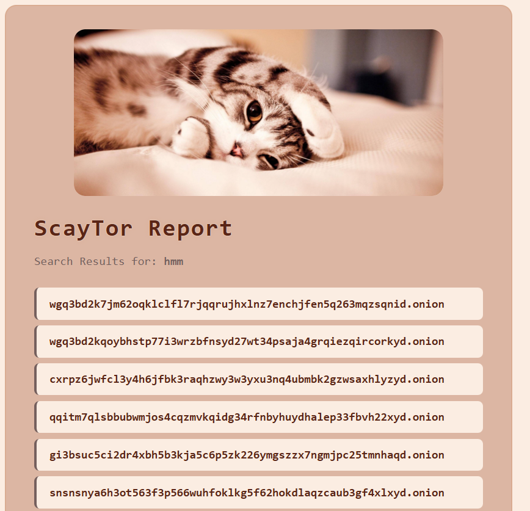

# 🕵️‍♂️ ScayTor

## What is ScayTor?

**ScayTor** is a modern, powerful, and smart tool for searching and collecting .onion (dark web) sites from the clearnet. It features a beautiful hacker-inspired CLI, generates stunning HTML reports with dark/light mode, and provides a seamless, user-friendly experience for security researchers, enthusiasts, and anyone exploring the Tor network.

---

## 🚀 Features

- **Modern CLI** with animated typing, colored output, and hacker vibes
- **Smart .onion extraction** from ahmia.fi search results
- **User-agent randomization** to avoid bans
- **Customizable result count**
- **Saves results to .txt and beautiful HTML reports**
- **HTML report with dark/light mode toggle**
- **Dynamic banner image (Scarycat for dark, CuteCat for light)**
- **Clickable .onion links in HTML**
- **Preview images for instant look**
- **Windows-friendly** (but works on any OS with Python)

---

## 🛠️ Installation

1. **Clone or Download** this repository.
2. Make sure you have **Python 3.8+** installed.
3. Install required Python packages:

```sh
pip install colorama requests
```

4. Place your `user-agents.txt` in the same folder (already included for you).

---

## ⚡ How to Use

### 1. **Run the Tool**

```sh
python TorSearch.py
```

### 2. **Follow the Prompts**
- Enter your search term (e.g., "marketplace")
- Enter how many .onion sites you want
- The tool will fetch, display, and save results

### 3. **HTML Report**
- After the search, an HTML report is generated automatically
- Open the `.html` file in your browser
- **Light mode** is default (shows CuteCat banner)
- Click the ☾ button to switch to **dark mode** (shows Scarycat banner)
- All .onion links are clickable (open in Tor Browser for best experience)

### 4. **Preview**

| Light Mode | Dark Mode | CLI |
|:---:|:---:|:---:|
|  |  |  |

---

## 💡 Tips
- For best results, use the HTML report in a modern browser
- You can edit the color palette and banners by replacing the PNGs
- The tool is designed for Windows, but works on Linux/Mac with Python

---

## 🧑‍🎤 Credits & Rights

**Author:** Scayar  
**Telegram:** [@im_scayar](https://t.me/im_scayar)  
**Email:** Scayar.exe@gmail.com  
**Buy Me a Coffee:** [buymeacoffee.com/scayar](https://buymeacoffee.com/scayar)  
All rights reserved © Scayar
